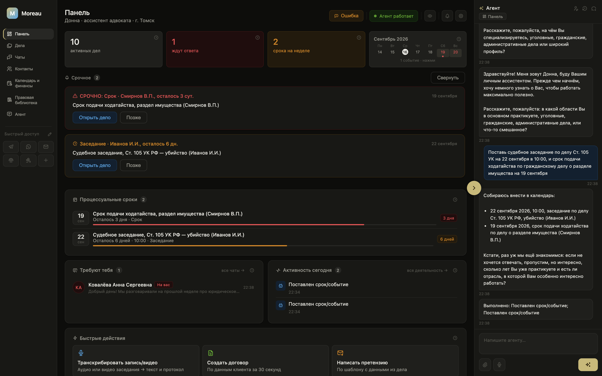
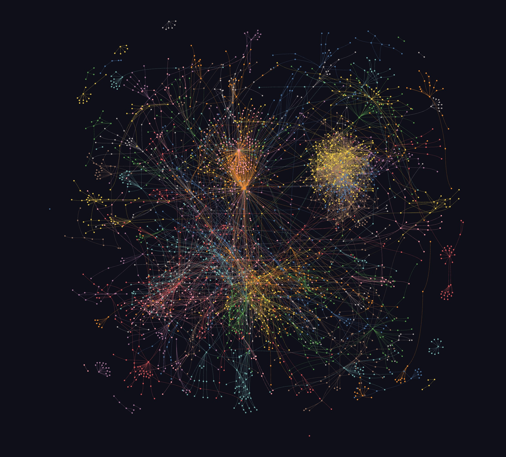
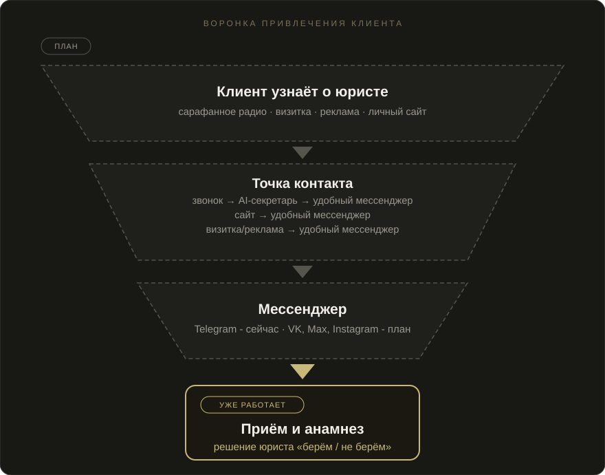

*[Читать по-русски](README.md)*

# Moreau

## Pitch

Moreau is an AI assistant for a lawyer. It works, doesn't sleep, gathers case intake, writes summaries, makes sure nothing gets forgotten, and helps the lawyer stay on top of routine work - it acts as a secretary and a personal assistant. A Telegram bot runs an unscripted client intake, captures the gist of the case, and hands it to the lawyer to review whenever is convenient, saving the time it would otherwise take to catch up on everything that happened while the lawyer was busy. A web app helps manage cases, documents, and deadlines, and remembers the specifics of each case and each client's habits. Changes to a case happen only with the lawyer's approval - the AI never decides anything on its own quietly. It's a live product with real users, built with 152-FZ (Russian personal-data law) requirements in mind so client personal data never physically leaves Russia. A substantial part is already built. It's an MVP currently being tested, and development continues toward full functionality. The product has about 43,000 lines of code and about 933 tests.

*The full codebase's dependency graph - a small glimpse of what's behind the repository. Made not for a wow effect, but to show scale without revealing how it's built.*

## Roadmap

Python (FastAPI, python-telegram-bot, python-docx, openpyxl, pytest), Anthropic Claude, Yandex Cloud (SpeechKit, Vision OCR, Object Storage), SQLite, ffmpeg, vanilla JS (ES modules), Claude Code, OpenAI Codex.

Full source available on request.

This repository reflects the product's state as of September 17, 2026. Development continues, and details may have changed since.
